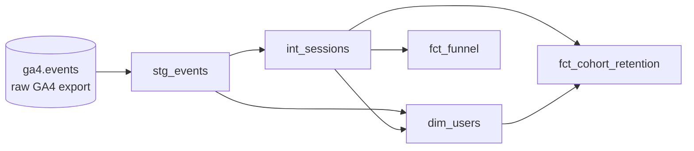

# GA4 Experimentation & Product Analytics

An analytics project on Google Analytics 4 e-commerce data: a tested dbt
pipeline on BigQuery that turns raw nested event data into funnel, user and
retention tables, followed by a simulated A/B test analysed with hand-written
statistics.

**Status:** the product analytics part (pipeline, funnel, retention) is
complete. The experimentation part is in progress; see [What's next](#whats-next).

## What this project shows

- Modelling raw GA4 export data in dbt, in three layers: staging, intermediate, marts
- Flattening GA4's nested `event_params` into usable columns
- Checking every model against the raw totals, plus 46 automated dbt tests
- Product analytics: a purchase funnel, weekly cohort retention, a user table
- Keeping BigQuery costs low: the whole pipeline builds for about 3 GB scanned

## The data

The source is Google's public GA4 sample,
`bigquery-public-data.ga4_obfuscated_sample_ecommerce`, which holds real
traffic from the Google Merchandise Store.

| | |
|---|---|
| Period | 2020-11-01 to 2021-01-31 (92 daily tables) |
| Events | 4,295,584 |
| Sessions | 360,129 |
| Users | 270,154 |
| Purchases | 5,692, worth $362,165 |

The dataset is **obfuscated**: Google replaced or removed some values before
publishing it. This affects some results, and the [Limitations](#limitations)
section says where.

## The pipeline



The same lineage as dbt draws it (`dbt docs serve`):


| Model | Layer | One row per | Rows |
|---|---|---|---|
| `stg_events` | staging | event | 4,295,584 |
| `int_sessions` | intermediate | session | 360,129 |
| `dim_users` | mart | user | 270,154 |
| `fct_funnel` | mart | day and device category | 276 |
| `fct_cohort_retention` | mart | cohort week and weeks since first visit | 91 |

What each layer does:

- **Staging** reads the raw export once and flattens `event_params`, an array
  of key/value pairs stored inside each event row, into ordinary columns. It
  is built as a table so nothing downstream rescans the raw data.
- **Intermediate** rolls events up into sessions: timing, engagement, traffic
  source, and which funnel steps happened.
- **Marts** are the tables an analyst would query: users, the funnel, and
  retention.

Every model and column is documented in YAML next to the SQL, and the SQL is
commented to explain each non-obvious choice.

## Results

### Purchase funnel

Share of all sessions in which each step occurred.

| Step | Sessions | Share of all sessions |
|---|---|---|
| All sessions | 360,129 | 100% |
| Viewed an item | 77,020 | 21.4% |
| Added to cart | 15,188 | 4.2% |
| Began checkout | 11,106 | 3.1% |
| Purchased | 4,848 | 1.3% |

The largest drop is between viewing an item and adding it to the cart: only
about one in five item-viewing sessions adds anything.

### Conversion by month

| Month | Sessions | Sessions with a purchase | Conversion |
|---|---|---|---|
| November 2020 | 108,401 | 1,618 | 1.49% |
| December 2020 | 133,351 | 2,115 | 1.59% |
| January 2021 | 118,377 | 1,115 | 0.94% |

Conversion in January is about 60% of December's, a plausible drop after the
holiday season. This matters for the experiment, which runs on January
traffic: its baseline has to come from January, not from the three-month
average.

### Retention

Users are grouped by the week of their first visit. The table shows the
percentage of each group that came back in later weeks, for a few of the 13
cohorts.

| First visit, week of | Users | Week 1 | Week 2 | Week 3 | Week 4 |
|---|---|---|---|---|---|
| 2020-11-01 | 17,160 | 4.2% | 1.9% | 1.2% | 1.2% |
| 2020-11-08 | 14,777 | 5.5% | 2.4% | 1.7% | 1.7% |
| 2020-11-29 | 21,368 | 5.2% | 2.1% | 0.7% | 0.6% |
| 2020-12-13 | 24,771 | 2.8% | 0.9% | 1.1% | 0.8% |
| 2020-12-27 | 16,389 | 2.5% | 0.9% | 0.5% | 0.5% |
| 2021-01-10 | 21,278 | 3.5% | 1.4% | | |

- Retention is low: between 2.4% and 5.5% of users return the week after
  their first visit. 82% of users have exactly one session in the three months.
- December cohorts are the largest and retain worst, which fits one-off
  holiday gift shopping.

### Users

- 4,419 of 270,154 users (1.6%) purchased at least once; 775 purchased more
  than once.

## Design decisions

- **A session is `user_pseudo_id` plus `ga_session_id`.** GA4's session id is
  only unique within one user, so the two are combined into `session_key`.
- **An event is identified by user, timestamp and event name.** GA4 has no
  event id. This combination is unique across all 4.3 million events, and a
  dbt test enforces it on every build.
- **A purchase is an event named `purchase`.** The order id is missing on 906
  of the 5,692 purchase events (16%), so counting by order id would miss them.
- **The funnel is session-level and steps count in any order.** A session
  counts for a step if the event occurred in it. Requiring the earlier steps
  in the same session would discard 46% of checkouts, because many carts are
  filled in an earlier session.
- **Retention covers new users only.** About 3% of users already existed
  before the data starts. Their real first week is unknown, so they are left
  out of the cohorts.
- **The funnel table stores counts, not rates.** Rates are computed after
  summing counts. Averaging daily rates would give a wrong answer.

## Data quality

- **46 dbt tests**, all passing: a `unique` and `not_null` test on every
  model's primary key, `not_null` on the columns later steps depend on, an
  `accepted_values` test on device category, and a `relationships` test that
  every session's user exists in `dim_users`.
- **Every model reconciles with the one before it.** `stg_events` has the
  same row count, purchase count and revenue as the raw data. The session and
  user tables sum back to the same 4,295,584 events and $362,165.
- **One retention figure was recounted independently**, straight from the
  sessions table with plain date ranges, and matched the mart.

## How to run it

You need Python 3.11, the [gcloud CLI](https://cloud.google.com/sdk/docs/install),
and a Google Cloud project with BigQuery enabled. The free BigQuery sandbox is
enough; no billing account is required.

1. Clone the repository and install the packages:

   ```
   git clone https://github.com/nachogd99/ga4-experimentation-analytics.git
   cd ga4-experimentation-analytics
   python -m venv venv
   venv\Scripts\activate
   pip install -r requirements.txt
   ```

   On macOS or Linux, activate with `source venv/bin/activate` instead.

2. Log in to Google Cloud. dbt uses these credentials, so no key file is needed:

   ```
   gcloud auth application-default login
   ```

3. Create the dbt profile at `~/.dbt/profiles.yml`. It is deliberately not in
   this repository. Replace the project id with your own:

   ```yaml
   ga4_analytics:
     target: dev
     outputs:
       dev:
         type: bigquery
         method: oauth
         project: your-gcp-project-id
         dataset: dbt_dev
         location: US
         threads: 4
         # Safety cap: BigQuery rejects any query that would scan more than 5 GB
         maximum_bytes_billed: 5000000000
   ```

4. Build and test everything:

   ```
   cd ga4_analytics
   dbt debug
   dbt build
   ```

   `dbt debug` checks the connection. `dbt build` creates the five tables and
   runs the 46 tests. A full build scans about 3 GB, well inside BigQuery's
   free 1 TB per month.

5. Optionally, browse the documentation and lineage graph:

   ```
   dbt docs generate
   dbt docs serve
   ```

Tables in the BigQuery sandbox expire after 60 days. Running `dbt build`
again recreates them.

## Limitations

These come from the obfuscation of the public dataset, and are worth knowing
before reading the results as facts about a real store.

- **Traffic source is unreliable.** 26% of sessions have no source at all, 15%
  are self-referrals from the store's own domain, and some values are
  replaced by `<Other>` or `(data deleted)`. A user's first-touch source,
  which GA4 means to be constant, differs between events for about 15% of
  users. For this reason no result here is broken down by channel.
- **The funnel is almost identical on desktop, mobile and tablet.** Real
  stores usually convert worse on mobile, so this is more likely an effect of
  the obfuscation than a finding.
- **A user is a browser.** The dataset has no logged-in user id, so one
  person on two devices counts as two users.

## What's next

The second part of the project is an A/B test analysis. **The experiment is
simulated on real traffic:** the Google Merchandise Store did not run this
test. Users are assigned to control and treatment by hashing their id, so the
assignment is real and reproducible, but any treatment effect is injected in
Python and stated as such. The dbt tables always contain real, unmodified data.

Planned:

- Hash-based assignment of users active in January 2021, with December 2020
  as the pre-period
- An A/A test first, to confirm the pipeline produces false positives at the
  expected 5% rate
- Statistics written by hand: power analysis, a two-proportion z-test, a
  sample ratio mismatch check, and CUPED variance reduction
- A Streamlit app and a written experiment readout

## Repository layout

| Path | Contents |
|---|---|
| `ga4_analytics/` | The dbt project: models, tests and documentation |
| `docs/` | Screenshots and the project backlog |
| `requirements.txt` | Python packages |

## Stack

BigQuery (sandbox), dbt-core 1.12 with dbt-bigquery, Python 3.11.
