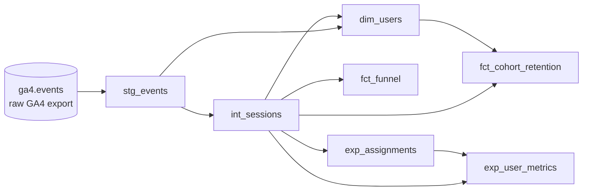
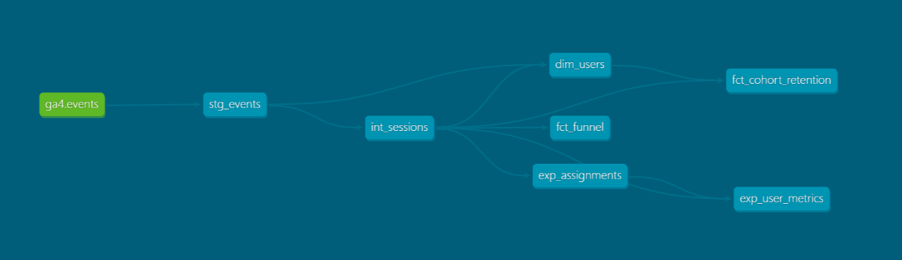
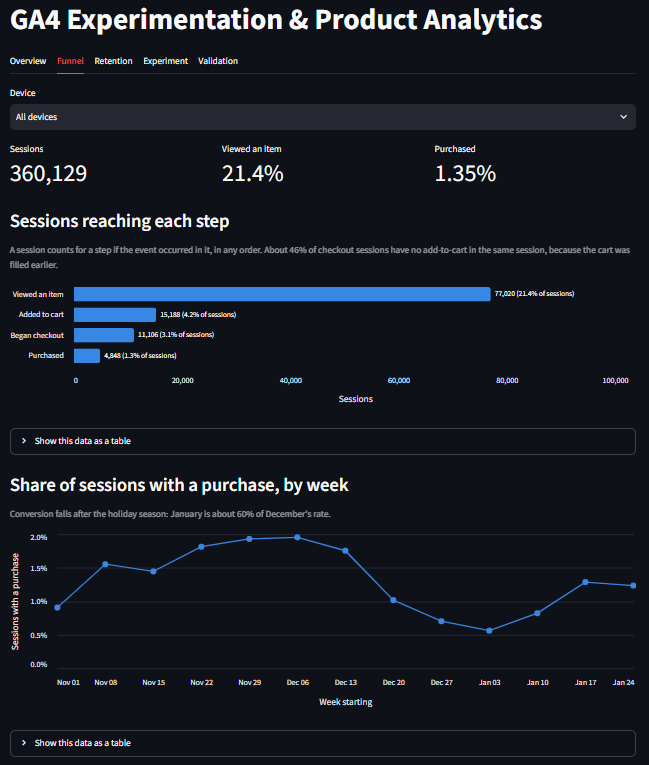
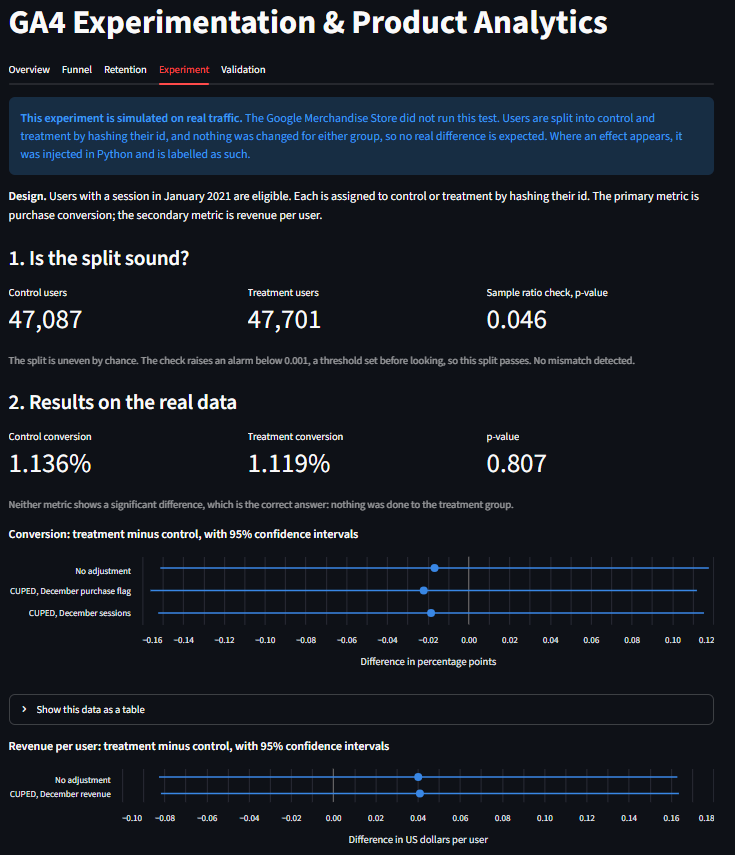
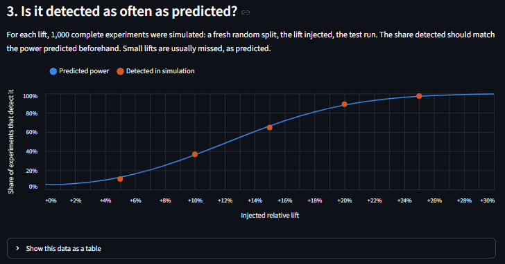

# GA4 Experimentation & Product Analytics

An analytics project on Google Analytics 4 e-commerce data, in two parts:

1. **Product analytics.** A tested dbt pipeline on BigQuery that turns raw
   nested event data into funnel, user and retention tables.
2. **Experimentation.** A simulated A/B test on that data, analysed with
   statistics written out by hand and validated with an A/A test and a planted
   effect.

> **The experiment is simulated on real traffic.** The Google Merchandise Store
> did not run this test. Users are split by hashing their id and nothing was
> changed for either group. Any treatment effect shown is injected in Python
> and labelled as such. The dbt tables always contain real, unmodified data.

## What this project shows

- Modelling raw GA4 export data in dbt, in three layers: staging, intermediate, marts
- Flattening GA4's nested `event_params` into usable columns
- Data quality: 69 dbt tests, and every model reconciled against the raw totals
- Product analytics: a purchase funnel, weekly cohort retention, a user table
- Experiment analysis written by hand: a two-proportion z-test, a sample ratio
  mismatch check, power analysis and CUPED, with 56 tests against statsmodels and scipy
- Validating the analysis itself: an A/A test across 1,000 splits and a lift of
  known size, detected as often as the power analysis predicted
- Reporting results that are not flattering: this experiment can only detect
  large effects, and CUPED barely helps on this data
- Keeping BigQuery costs low: the whole pipeline builds for about 3 GB scanned

## The data

The source is Google's public GA4 sample,
`bigquery-public-data.ga4_obfuscated_sample_ecommerce`, which holds real
traffic from the Google Merchandise Store.

| | |
|---|---|
| Period | 2020-11-01 to 2021-01-31 (92 daily tables) |
| Events | 4,295,584 |
| Sessions | 360,129 |
| Users | 270,154 |
| Purchases | 5,692, worth $362,165 |

The dataset is **obfuscated**: Google replaced or removed some values before
publishing it. This affects some results, and the [Limitations](#limitations)
section says where.

## The pipeline



The same lineage as dbt draws it (`dbt docs serve`):



| Model | Layer | One row per | Rows |
|---|---|---|---|
| `stg_events` | staging | event | 4,295,584 |
| `int_sessions` | intermediate | session | 360,129 |
| `dim_users` | mart | user | 270,154 |
| `fct_funnel` | mart | day and device category | 276 |
| `fct_cohort_retention` | mart | cohort week and weeks since first visit | 91 |
| `exp_assignments` | mart, experiment | eligible user | 94,788 |
| `exp_user_metrics` | mart, experiment | eligible user | 94,788 |

What each layer does:

- **Staging** reads the raw export once and flattens `event_params`, an array
  of key/value pairs stored inside each event row, into ordinary columns. It
  is built as a table so nothing downstream rescans the raw data.
- **Intermediate** rolls events up into sessions: timing, engagement, traffic
  source, and which funnel steps happened.
- **Marts** are the tables an analyst would query: users, the funnel,
  retention, and the experiment's assignments and per-user metrics.

Every model and column is documented in YAML next to the SQL, and the SQL is
commented to explain each non-obvious choice.

## Product analytics results

### Purchase funnel

Share of all sessions in which each step occurred.

| Step | Sessions | Share of all sessions |
|---|---|---|
| All sessions | 360,129 | 100% |
| Viewed an item | 77,020 | 21.4% |
| Added to cart | 15,188 | 4.2% |
| Began checkout | 11,106 | 3.1% |
| Purchased | 4,848 | 1.3% |

The largest drop is between viewing an item and adding it to the cart: only
about one in five item-viewing sessions adds anything.

### Conversion by month

| Month | Sessions | Sessions with a purchase | Conversion |
|---|---|---|---|
| November 2020 | 108,401 | 1,618 | 1.49% |
| December 2020 | 133,351 | 2,115 | 1.59% |
| January 2021 | 118,377 | 1,115 | 0.94% |

Conversion in January is about 60% of December's, a plausible drop after the
holiday season. The experiment runs on January traffic, so its baseline comes
from January and not from the three-month average.

### Retention

Users are grouped by the week of their first visit. The table shows the
percentage of each group that came back in later weeks, for a few of the 13
cohorts.

| First visit, week of | Users | Week 1 | Week 2 | Week 3 | Week 4 |
|---|---|---|---|---|---|
| 2020-11-01 | 17,160 | 4.2% | 1.9% | 1.2% | 1.2% |
| 2020-11-08 | 14,777 | 5.5% | 2.4% | 1.7% | 1.7% |
| 2020-11-29 | 21,368 | 5.2% | 2.1% | 0.7% | 0.6% |
| 2020-12-13 | 24,771 | 2.8% | 0.9% | 1.1% | 0.8% |
| 2020-12-27 | 16,389 | 2.5% | 0.9% | 0.5% | 0.5% |
| 2021-01-10 | 21,278 | 3.5% | 1.4% | | |

- Retention is low: between 2.4% and 5.5% of users return the week after
  their first visit. 82% of users have exactly one session in the three months.
- December cohorts are the largest and retain worst, which fits one-off
  holiday gift shopping.
- 4,419 of 270,154 users (1.6%) purchased at least once; 775 purchased more
  than once.

## The experiment

The full write-up is in **[docs/experiment_readout.md](docs/experiment_readout.md)**.
In short:

**Design.** The 94,788 users with a session in January 2021 are split into
control and treatment by hashing their id with a salt. The primary metric is
purchase conversion; the secondary metric is revenue per user. December 2020
is the pre-period for CUPED.

**Result on the real data.** No difference, which is correct since nothing was
done to the treatment group.

| Metric | Control | Treatment | Difference | p-value |
|---|---|---|---|---|
| Conversion | 1.136% | 1.119% | -0.017 points | 0.81 |
| Revenue per user | $0.585 | $0.625 | +$0.040 | 0.52 |

**Can the analysis be trusted?** Two checks say yes.

- *A/A test.* The users were re-split 1,000 times with no effect present. The
  test raised a false alarm 4.4% of the time, against an expected 5% and inside
  the 3.65% to 6.35% range set before running it.
- *Planted effect.* With a +25% lift injected into treatment, the test detects
  it (p = 0.0001) and measures it as +24.9%. Across 1,000 simulated experiments
  per lift size, detection rates match the predicted power:

| Injected lift | Detected | Predicted power |
|---|---|---|
| +5% | 11.0% | 12.8% |
| +10% | 36.7% | 36.1% |
| +15% | 64.7% | 66.3% |
| +20% | 89.0% | 88.0% |
| +25% | 97.5% | 97.2% |

**Two findings that are less flattering, and stated anyway.**

- *The experiment can only detect large effects.* With a 1.13% baseline and
  about 47,000 users per group, the minimum detectable effect is +17.8%
  relative. A +10% lift would be missed almost two times in three.
- *CUPED barely helps here.* Only 3.4% of eligible users were active in
  December, so the pre-period covariate is zero for almost everyone. CUPED
  removes at most 1% of the variance. The method works on data with returning
  users; this store, over this period, mostly has none.

The statistics are in [analysis/stats.py](analysis/stats.py), with each formula
written out and commented. The only things taken from a library are the normal
and chi-square distributions.

## The app

A Streamlit app presents the funnel, retention, the experiment and its
validation. It reads small CSV files committed to this repository, so it runs
without BigQuery credentials.







## Design decisions

- **A session is `user_pseudo_id` plus `ga_session_id`.** GA4's session id is
  only unique within one user, so the two are combined into `session_key`.
- **An event is identified by user, timestamp and event name.** GA4 has no
  event id. This combination is unique across all 4.3 million events, and a
  dbt test enforces it on every build.
- **A purchase is an event named `purchase`.** The order id is missing on 906
  of the 5,692 purchase events (16%), so counting by order id would miss them.
- **The funnel is session-level and steps count in any order.** A session
  counts for a step if the event occurred in it. Requiring the earlier steps
  in the same session would discard 46% of checkouts, because many carts are
  filled in an earlier session.
- **Retention covers new users only.** About 3% of users already existed
  before the data starts. Their real first week is unknown, so they are left
  out of the cohorts.
- **The funnel table stores counts, not rates.** Rates are computed after
  summing counts. Averaging daily rates would give a wrong answer.
- **Assignment is a hash, not a stored random number.** The same user always
  lands in the same group, the split can be reproduced by anyone, and a
  different salt gives an independent split for the A/A test.
- **Thresholds are set before looking.** The sample ratio alert (0.001) and
  the A/A pass range were fixed in advance, so the results could not shape them.

## Data quality

- **69 dbt tests**, all passing: `unique` and `not_null` on every model's
  primary key, `not_null` on the columns later steps depend on,
  `accepted_values` on categories and flags, and `relationships` tests between
  sessions, users and experiment tables.
- **Every model reconciles with the one before it.** `stg_events` has the
  same row count, purchase count and revenue as the raw data. The session and
  user tables sum back to the same 4,295,584 events and $362,165.
- **56 Python tests** for the statistics and the simulation harness. Each
  function is compared with statsmodels or scipy, and the power analysis is
  also checked against a simulation.

## How to run it

To see the app only, steps 1 and 7 are enough: it reads files that are already
in the repository.

You need Python 3.11. For the pipeline you also need the
[gcloud CLI](https://cloud.google.com/sdk/docs/install) and a Google Cloud
project with BigQuery enabled. The free BigQuery sandbox is enough; no billing
account is required.

1. Clone the repository and install the packages:

   ```
   git clone https://github.com/nachogd99/ga4-experimentation-analytics.git
   cd ga4-experimentation-analytics
   python -m venv venv
   venv\Scripts\activate
   pip install -r requirements.txt
   ```

   On macOS or Linux, activate with `source venv/bin/activate` instead.

2. Log in to Google Cloud. dbt and the Python scripts use these credentials,
   so no key file is needed:

   ```
   gcloud auth application-default login
   ```

3. Create the dbt profile at `~/.dbt/profiles.yml`. It is deliberately not in
   this repository. Replace the project id with your own:

   ```yaml
   ga4_analytics:
     target: dev
     outputs:
       dev:
         type: bigquery
         method: oauth
         project: your-gcp-project-id
         dataset: dbt_dev
         location: US
         threads: 4
         # Safety cap: BigQuery rejects any query that would scan more than 5 GB
         maximum_bytes_billed: 5000000000
   ```

4. Build and test the pipeline:

   ```
   cd ga4_analytics
   dbt debug
   dbt build
   cd ..
   ```

   `dbt debug` checks the connection. `dbt build` creates the 7 tables and
   runs the 69 tests. A full build scans about 3 GB, well inside BigQuery's
   free 1 TB per month.

5. Run the Python tests. These need no BigQuery connection:

   ```
   python -m pytest analysis
   ```

6. Optionally, rerun the experiment analysis. Set your project id at the top
   of `analysis/data.py` first:

   ```
   python -m analysis.run_aa_test
   python -m analysis.run_lift_injection
   python -m analysis.export_app_data
   ```

7. Start the app:

   ```
   streamlit run app/app.py
   ```

To browse the dbt documentation and lineage graph, run `dbt docs generate`
and then `dbt docs serve` from `ga4_analytics/`.

Tables in the BigQuery sandbox expire after 60 days. Running `dbt build`
again recreates them.

## Limitations

- **The experiment is simulated.** It demonstrates and validates an analysis
  pipeline. It says nothing about any real product change.
- **Traffic source is unreliable.** 26% of sessions have no source at all, 15%
  are self-referrals from the store's own domain, and some values are
  replaced by `<Other>` or `(data deleted)`. A user's first-touch source,
  which GA4 means to be constant, differs between events for about 15% of
  users. For this reason no result here is broken down by channel.
- **The funnel is almost identical on desktop, mobile and tablet.** Real
  stores usually convert worse on mobile, so this is more likely an effect of
  the obfuscation than a finding.
- **A user is a browser.** The dataset has no logged-in user id, so one
  person on two devices counts as two users.
- **Revenue is heavy-tailed.** The revenue test relies on the normal
  approximation; capping extreme values or bootstrapping would be more robust.

## Repository layout

| Path | Contents |
|---|---|
| `ga4_analytics/` | The dbt project: models, tests and documentation |
| `analysis/stats.py` | The statistical functions |
| `analysis/simulations.py` | The A/A test and lift injection harness |
| `analysis/data.py` | Loads the dbt tables from BigQuery |
| `analysis/tests/` | Python tests |
| `analysis/results/` | Saved results of the A/A test and lift injection |
| `app/` | The Streamlit app and its data files |
| `docs/` | The experiment readout, screenshots and the project backlog |

## How this was built

I built this project with Claude Code, an AI coding assistant, working one
small step at a time. I set the roadmap and the experiment design, reviewed
each step before it was committed, and had each statistical function explained
as it was written. `CLAUDE.md` holds the rules the assistant worked under, and
`docs/backlog.md` records the decisions and deferred items along the way.

## Stack

BigQuery (sandbox), dbt-core 1.12 with dbt-bigquery, Python 3.11 (pandas,
scipy, statsmodels for test comparisons), Streamlit and Altair.
